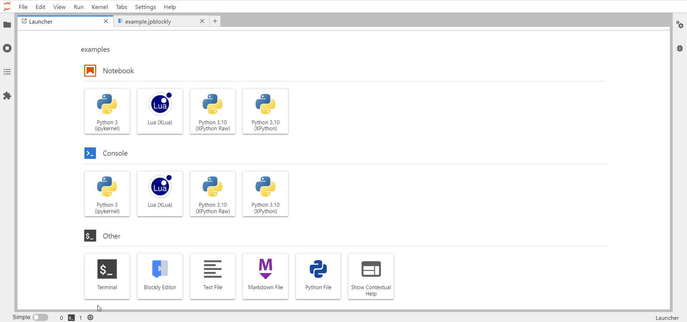

# Blockly Editor

The Blockly editor is mainly composed of two elements: the **toolbox**, situated on the left side of the screen and composed of all the available blocks organised in categories, and the **workspace**, a canvas where you can drag and drop the the chosen blocks for your code.

## Executing your code

Once you think your code is ready you can press the **Run** button, found in the upper-left corner. The generated code in the chosen programming language will appear at the bottom of the screen in a Juypter code cell, along with the output.

## Modifying your code

You have full freedom to change the position of any blocks in the workspace, as well as remove the ones you don't want to use anymore, by dragging them to the trash bin positioned at the bottom-right corner.

You can also organize your code in multiple sets of blocks. The generated code will be rendered in the order they are placed on the screen.

**NOTE** : By right clicking anywhere on the workspace you can get a set of possible commands, such as _Undo_, _Redo_ or _Delete # Blocks_. This gives you more freedom to edit of your canvas.
