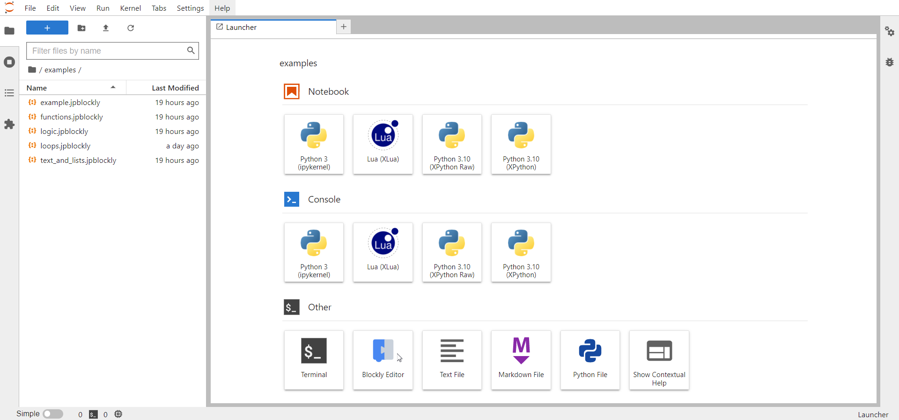
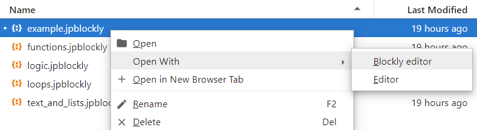

# Blockly Files

## Open from Launcher

You can easily open a new Blockly editor directly from the launcher.

## Open a .jpblockly file

To open a file you have previously worked in the Blockly editor you can easily right click on the file and select "Open With" > "Blockly Editor".

