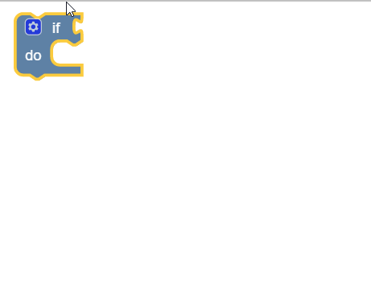
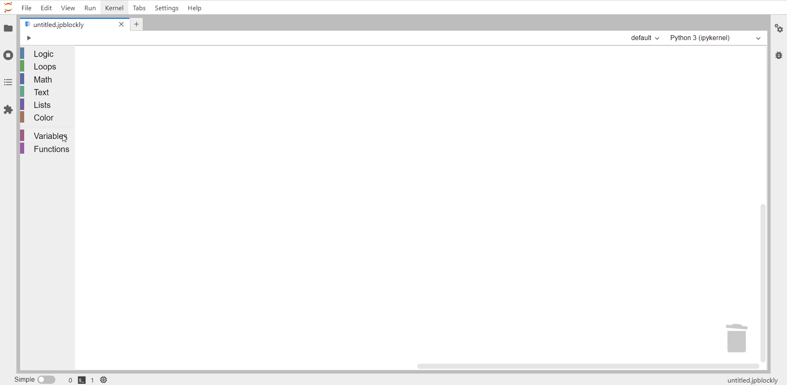
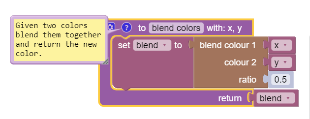

# Examples

To help gain a better understanding of the JupyterLab-Blockly, we created some examples you can easily access and experiment with. They can be accessed from the folder `examples` in the Github repository.

The examples give you a chance to be introduced to the most important blocks and their functionalities. The extension is a great tool for introducing the most relevant concepts of coding by also letting you see the rendered code. Once you have gotten a good grasp on it, you can easily use the familiar Jupyter enviroment to move to another classical programming language, such as Python.

## Logic Blocks Example

The example in `logic.jpblockly` takes a random integer and checks if it respects certain conditions, through a series of `if-else` statements, and returns appropiate messages.

**NOTE** : Any block that has the settings icon in the upper-left corner offers the possibility of adding extra fields, thus you can modify the `if` standard block to adapt to your code by adding the needed `else if` or `else` clauses.

  

## Loop Blocks Example

In `loops.jpblockly`, we use a standard loop with initial condition to iterate from 1 to 15 and print a message at each step and one to mark the exit from the loop.

In order to iterate through the loop, we created a variable `count`. You can create variables by simply accessing the **Variables** category from the toolbox and pressing the button _Create variable..._. Once you have named and created your variable, a new selection of blocks will appear for it in the category.

  

## Texts and Lists Blocks Example

In the `text_and_lists.jpblockly` example, we are using several of the offered blocks from the two categories, to modify or offer information from a string saved in the variable `sentence`.

## Function and Color Blocks Example

In `functions.jpblockly`, we are creating a function `blend colors` which takes two randomly chosen colors and returns a new color, formed by blending the inputs, using a `color` block.

When creating a function, you can choose a name for it, the number of inputs (by pressing the settings icon), whether it has an output or not and write a comment for it to explain its functionality (by pressing the question mark icon).

  

**NOTE** : You can add a comment to any icon by right clicking on it and choosing `Add comment`. The added text will appear in the generated code, above the selected block as a comment.
