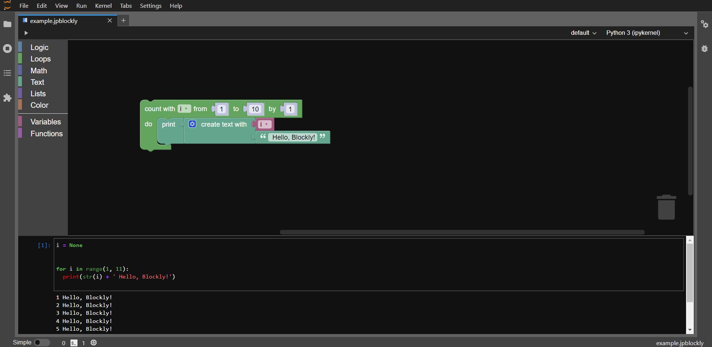

# JupyterLab Integration

The JupyterLab-Blockly extension is fully integrated in the Jupyter enviroment to offer a seamless experience to the user. Thus, the Blockly editor automatically adapts to any modyfication you make to JupyterLab's appearance.

## Theme

The Blockly editor changes its theme in accordance to the JupyterLab one, whether it's the standard light or dark ones or a personalized one.

Below is an example of how the Blockly editor looks with the dark theme.

You can experiment with this by pressing "Settings" > "Theme", from the JupyterLab toolbar.

## Internalization

If you prefer using JupyterLab in another language, the Blockly editor can also render its blocks and additional messages (visible by right clicking on any block or in the workspace) in the selected language.

The extension can be rendered in all the languages available in JupyterLab. A complete list can be seen [here](https://github.com/jupyterlab/language-packs/tree/master/language-packs).

**NOTE** : This feature is a work in progress, so the names of the categories from the toolbox are only offered in English so far.
