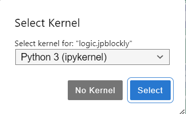
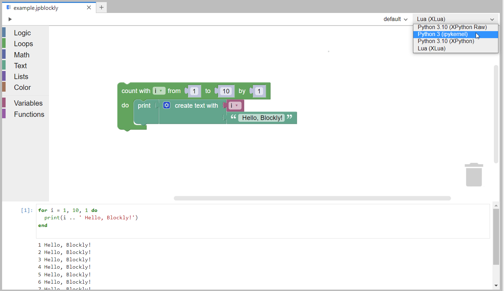

# Kernels

The JuypterLab-Blockly extension uses Jupyter kernels for the execution of the generated code.

## Kernel Selection

When you open a file in the Blockly editor, you will be propted to choose your preferred kernel. At the moment, you can choose between :

- ipykernel
- xeus-python
- xeus-lua
- [JavaScript](https://github.com/n-riesco/ijavascript#installation)
- [JavaScript](https://github.com/yunabe/tslab)

  

This will only be your initial kernel selection, as you can always change it to another one after you open the file.

## Changing Kernels

If you wish to switch to another kernel, you have the freedom to do it at any point, by clicking on the drop down menu situated at the upper-right corner of the Blockly editor.

Once you have made your new selection, your code will automatically be executed using the new kernel, as such also rendering the code in its respective programming langauage.
