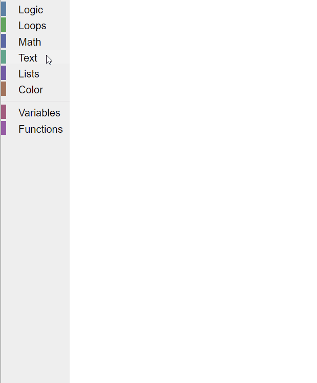
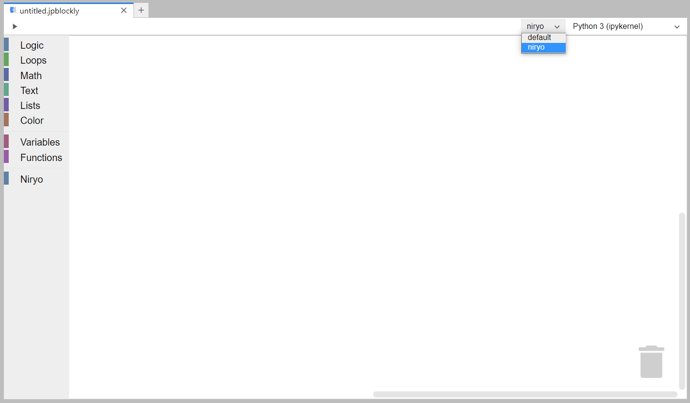

# Toolbox

The toolbox, a main element of the Blockly editor, is situated on the left side of the screen. It encompasses all available blocks, organized in categories for easier access.

  

## Switching to another toolbox

If you have installed or created another extension, on top of the JupyterLab-Blockly extension, which includes a new tooolbox, you can switch to it by simply pressing the drop down menu on the upper-right corner.

**NOTE** : The toolbox `niryo` from the image above is part of the JupyterLab-Niryo-One extension, which is built on top of the JupyterLab-Blockly extesnion and is meant to offer blocks which can control the Niryo One robot. You can read more about it on its [Github repository](https://github.com/QuantStack/jupyterlab-niryo-one).
